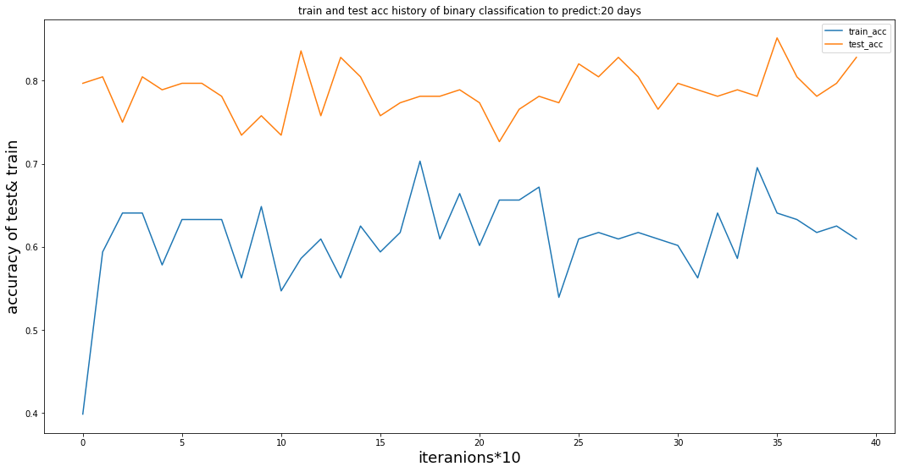
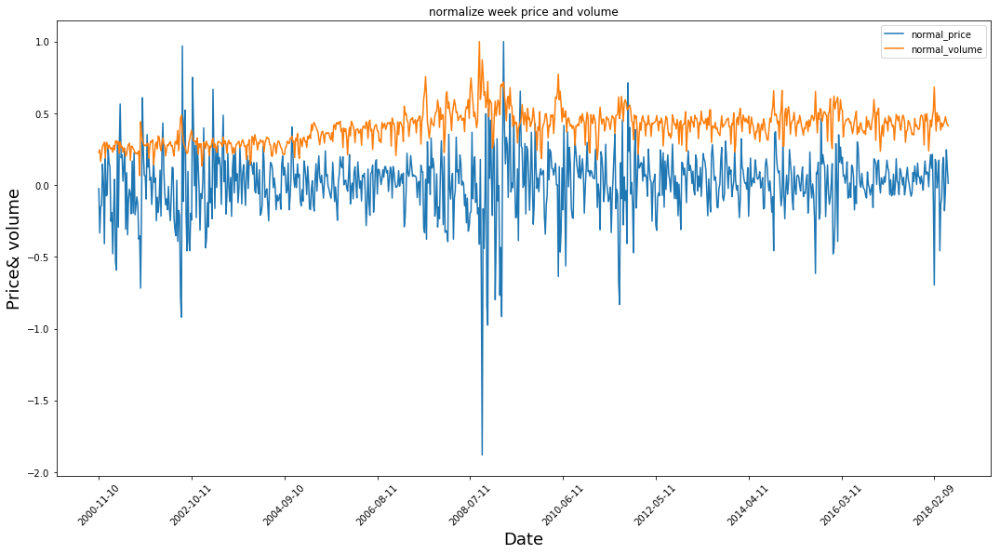

Stock Movement Predictions with price and volume
======================================
This project can
*Predict the movement of the target stock with price and volume 
*Support the predicitons of 1 day, 1 week(5T), 1 month (20T), usesage --day={1,5,20}
*Predict the movement with --predict_type={binary,4class}, there are 2 types support,  binary, 4class
	1. binary : tries to predict the movement with 2 kinds, up, down
	2. 4class： tries to predict the movement with 4 kinds, up, strong up, down, strong down

You can also tune other parameters, use 
```
python2 stock_pred.py --help 
```
for more infomation. stock_pred.py is in the folder clean python
.
How to implement?
====================================
You can run stock_all_pred.ipynb with jupyter notebook or
run with python files in clean_pyhton2. Use the following command.

```
python2 stock_pred.py --predict_type=<type> --day=<day>
```
Replace <type> with either 4class, binary, <day> with 1,5, or 20

Now only support train-mode. The trained model is stored in checkpoints folder.


Results:
======================
Since we only care about the movement, we don't output the continuous price value prediction.
Instead, we output with discrete classes. The best way to measure our results
is the accuracy of predictions comparing to the actual movement. 
For 4class, we also provied the accuracy of right direction predictions called test_acc_s.
Both up, strong up are classified as positive, and down, strong down are negative.

A sample plot is below. The test_acc is larger than train_acc since we have dropout mechanism for training.

The final test accuracy after 1000 iterations:
```
       		|1d  | 5d | 20d
binary 		|0.56|0.63|0.76
4class 		|0.31|0.4 |0.37
4class_s        |0.61|0.58|0.67
```

Other Details:
====================================
We have preprocessed the input for our training.
Instead of using the price value directly, we use percentange of changing comparing to previous day.
Normalize the volume, and price with the maxmum value.
The plot shows the price, volume after normalizaiton.

We not only use the day sequence data, but also week sequence data together, as a result, we need two LSTMs.
The sequence of day by default is 20, while the sequence of week by default is 12. One can change the value by flag
--day_unroll=<# days>, --week_unroll=<# weeks>

 


